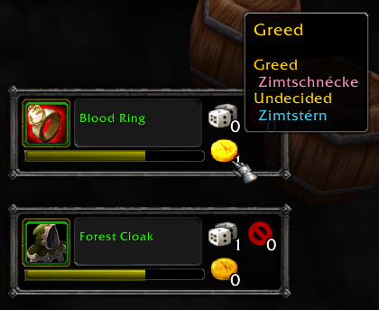
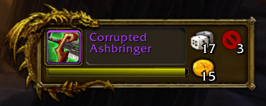
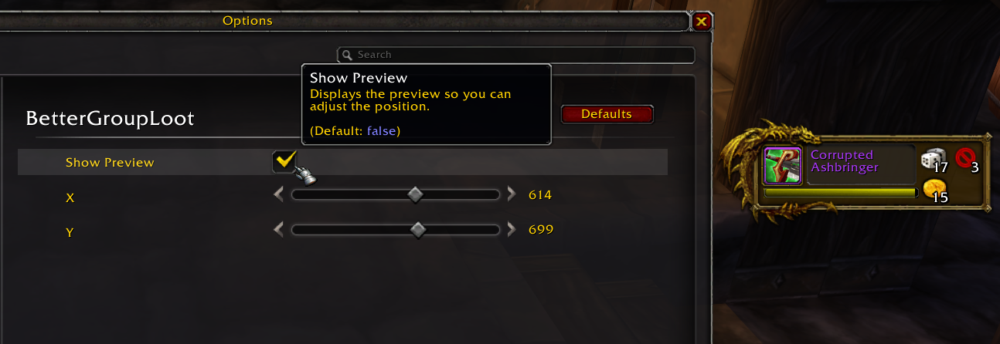

# \# BetterGroupLoot

Simple addon to improve the GroupLootFrame.

## Features

Improves the style of the default GroupLootFrame.
Adds a count to the different loot options (Need/Green/Pass), and also shows what individual players have selected in the tooltip.
Allows moving the frame to any position on the screen.

Also adds simple configuration for:

- Show Preview
- Change X/Y coordinate of the frame

Uses the default API, but modifies the default Blizzard GroupLootFrame.
Should be compatible with any addon that doesn't mess with the GroupLootFrame.

Note: If you are using [DragonflightUI classic](https://www.curseforge.com/wow/addons/dragonflight-ui-classic) you dont need this, as this addon is based on the DFUI code; the functionality is included in the UI Module there.

## Screenshots

## For addon developers

Source code released under MIT licence.

Can be embeded, but the embedding functionality is not 100% there; feel free to contact me and I will add all you need + instructions!
